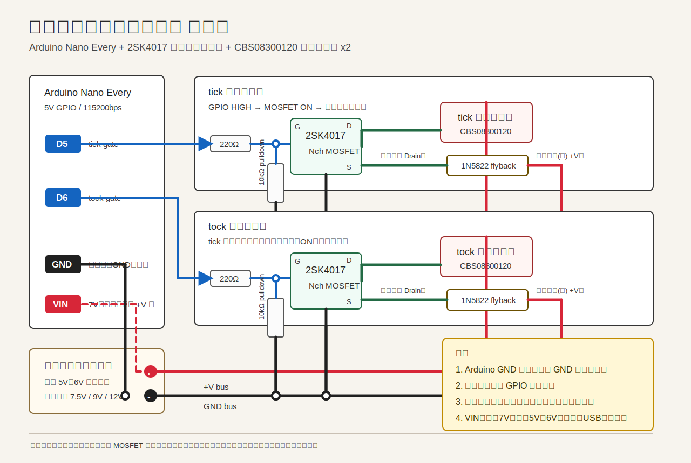

# アンティーク振り子時計風 チク・タク音源ユニット

Arduino Nano Every から2個のソレノイドを短いパルスで駆動し、物理的な `tick` / `tock` 音を作る試作用 PlatformIO プロジェクトです。

時計本体の時刻表示や振り子駆動は市販ムーブメントに任せ、このプロジェクトでは音だけを作ります。現時点では振り子同期は行わず、Serial Monitor から調整しながら 1秒ごとに交互駆動します。

## ハードウェア前提

### MCU

- 製品名: Arduino Nano Every
- Arduino公式型番: ABX00028
- MCU: ATmega4809
- 動作電圧: 5V
- PlatformIO board: `nano_every`
- Serial速度: 115200bps

`platformio.ini`:

```ini
[env:nano_every]
platform = atmelmegaavr
board = nano_every
framework = arduino
monitor_speed = 115200
```

### ソレノイド

- 商品名: プッシュネジソレノイド
- 型番: CBS08300120
- 秋月電子 通販コード: 131028
- 定格目安: 連続6V、通電率25%で12V
- コイル抵抗: 約12Ω
- ストローク: 約5mm
- プッシュバー: M3 P0.5 ネジ加工あり
- tick用ソレノイド × 1
- tock用ソレノイド × 1

このソレノイドは本体のカチカチ音が出やすいため、コード側では短いパルス幅を初期値にし、Serial Monitor から調整できるようにしています。

## ピン割り当て

| 用途 | ピン |
| --- | --- |
| tick ソレノイド | D5 |
| tock ソレノイド | D6 |
| ステータスLED | D13 |
| 将来用 Hall 左 | D2 |
| 将来用 Hall 右 | D3 |

出力は active HIGH です。GPIO が HIGH の間だけ MOSFET が ON になり、ソレノイドに電流が流れます。

## 配線図



この図は概念図です。実配線では 2SK4017 の実際のピン配置、電源容量、配線の太さ、絶縁、発熱を確認してください。

## ソレノイド駆動回路

Arduino の GPIO からソレノイドを直接駆動しないでください。各ソレノイドは Nch MOSFET によるローサイドスイッチで駆動します。

想定部品:

- Nch MOSFET: 2SK4017
- 秋月電子 通販コード: 107597
- フライバックダイオード: 1N5822
- 秋月電子 通販コード: 102229
- ゲート抵抗: 220Ω
- ゲートプルダウン抵抗: 10kΩ

1チャンネル分の接続:

```text
外部電源 +V
  |
  +---- ソレノイド ----+---- MOSFET Drain
                       |
                 MOSFET Source
                       |
外部電源 GND ----------+---- Arduino GND

Arduino D5 または D6 ---- 220Ω ---- MOSFET Gate
MOSFET Gate ------------ 10kΩ ---- GND
```

- D5: tick 用 MOSFET Gate
- D6: tock 用 MOSFET Gate
- MOSFET Source: GND
- MOSFET Drain: ソレノイドのマイナス側
- ソレノイドのプラス側: 外部電源 +V

Arduino の GND と外部ソレノイド電源の GND は必ず共通にしてください。GND が共通でないと、Arduino の GPIO 電圧が MOSFET Gate の基準として正しく伝わりません。

## フライバックダイオード

ソレノイドはコイルなので、OFF した瞬間に逆起電力が発生します。これを放置すると MOSFET や Arduino に高い電圧ストレスがかかります。

各ソレノイドには必ずフライバックダイオードを並列に入れてください。

ダイオード向き:

- カソード、線がある側: 外部電源 +V 側
- アノード: MOSFET Drain 側

```text
外部電源 +V
  |
  +---- ソレノイド ----+---- MOSFET Drain
  |                    |
  +----|<|-------------+
       1N5822
```

## 電源と電流の目安

ソレノイド用電源は、まず定電圧電源で実験してください。

- まず 5V〜6V から開始
- 動作が弱ければ 7.5V、9V、12V と上げる
- 長時間ONにしない
- ソレノイドの発熱に注意

CBS08300120 は約12Ωなので、単純計算では以下が目安です。

| 電圧 | 1個あたりの電流目安 |
| --- | --- |
| 6V | 約0.5A |
| 9V | 約0.75A |
| 12V | 約1.0A |

このコードでは tick と tock が同時に ON にならないようにしています。最終電源候補として 12V 2A ACアダプタを使う場合でも、配線、MOSFET、ダイオード、ソレノイドの発熱を確認しながら進めてください。

## Arduino も同じ電源から動かす場合

同じ電源から Arduino とソレノイドを動かすことはできます。おすすめは、外部電源の +V をソレノイド側と Arduino `VIN` 側に分岐し、GND を共通にする構成です。

```text
外部電源 +V ----+---- tick/tock ソレノイド +側
                |
                +---- Arduino VIN

外部電源 GND ---+---- MOSFET Source
                |
                +---- Arduino GND
```

Nano Every の `VIN` は 7V 以上が前提です。そのため、ソレノイドを 7.5V、9V、12V で試す場合は同一電源から `VIN` へ入れられます。USBでSerial Monitorを開いたままでも、`VIN` から給電する構成が扱いやすいです。

ただし、5V〜6Vでソレノイドを試す段階では `VIN` 電圧が足りません。この段階では Arduino はUSB給電のままにするか、同じ電源から別途5Vレギュレータを使ってUSB 5V相当として給電してください。12VをArduinoの5Vピンへ入れるのは絶対に避けてください。

ソレノイドとArduinoを同じ電源にすると、ソレノイドON/OFF時の電圧降下やノイズでArduinoがリセットすることがあります。以下を入れると安定しやすくなります。

- 電源からソレノイド側とArduino側を星形に分岐する
- ソレノイド電源ラインに 470uF〜1000uF 程度の電解コンデンサを入れる
- Arduino の `VIN` / `GND` 近くに 47uF〜100uF 程度と 0.1uF を入れる
- 配線はソレノイド電流が流れる線を太め、短めにする
- リセットが出る場合は、12Vから小型DC-DCで 7.5V〜9V を作って `VIN` に入れる

## Serial Monitor

通信速度は `115200 bps` です。

起動時に `help` と `status` が自動表示されます。安全のため、初期値では `AUTO_START = false` になっているので、起動直後は停止状態です。

### コマンド

```text
help
run
stop
status
tick
tock
set tick_ms 8
set tock_ms 8
set interval_ms 1000
set max_pulse_ms 50
```

- `run`: 自動チクタク開始
- `stop`: 停止し、すべてのソレノイド出力を LOW
- `status`: 現在の設定と状態を表示
- `tick`: tick ソレノイドを1回だけ短く駆動
- `tock`: tock ソレノイドを1回だけ短く駆動
- `set tick_ms 8`: tick のパルス幅を 8ms に設定
- `set tock_ms 8`: tock のパルス幅を 8ms に設定
- `set interval_ms 1000`: 自動チクタク間隔を 1000ms に設定
- `set max_pulse_ms 50`: パルス幅の上限を 50ms に設定

## 初期設定

| 項目 | 初期値 |
| --- | --- |
| `AUTO_START` | `false` |
| `tick_ms` | `8` |
| `tock_ms` | `8` |
| `interval_ms` | `1000` |
| `max_pulse_ms` | `80` |
| `hard_max_pulse_ms` | `80` |
| `min_interval_ms` | `200` |

推奨パルス範囲は 3〜30ms です。安全上限は 80ms です。`pulse_ms` を 0 にすると、その音は鳴らしません。

## 調整手順

1. まず 5V〜6V の低い電圧から始めます。
2. Serial Monitor を 115200bps で開きます。
3. `tick` と `tock` を単発で試します。
4. `set tick_ms 5`、`set tick_ms 8`、`set tick_ms 10`、`set tick_ms 15`、`set tick_ms 20` のように短めから確認します。
5. tock 側も同じように `set tock_ms 5` から試します。
6. 音量、打撃感、ソレノイド本体のカチカチ音、発熱を確認します。
7. 動作が弱い場合だけ、7.5V、9V、12V と段階的に上げます。
8. 問題なければ `run` で自動チクタクを開始します。
9. 停止するときは `stop` を入力します。

長時間 ON になる設定は避けてください。このコードでは上限を設けていますが、ソレノイドの定格や電源条件によって安全な値は変わります。

## 機械調整の観点

- ソレノイド駆動電圧
- パルス幅
- ソレノイド先端と木片、金属板の距離
- ソレノイド固定部の防振
- 叩く面の素材

tock 用の木片はアカシア小片、tick 用は金属板を想定しています。音量が大きすぎる場合は、電圧やパルス幅だけでなく、固定方法と打点距離も調整してください。

## 安全上の注意

- ソレノイドを長時間通電しないでください。
- 発熱に注意してください。
- 電源容量に余裕を持たせてください。
- ソレノイドの定格電圧、定格電流、通電時間を超えないでください。
- フライバックダイオードを必ず入れてください。
- Arduino GND と外部電源 GND を必ず共通にしてください。
- ソレノイド電源を上げる前に、低電圧かつ短いパルスで動作確認してください。

## 実装メモ

- `delay()` は使わず、`millis()` ベースで動作します。
- `SolenoidPulse` が各ソレノイドの短パルス制御を担当します。
- `ClockSoundController` が tick / tock の交互制御、自動モード、単発トリガを担当します。
- Serial コマンドは固定長バッファで読み取り、長すぎる入力では出力を LOW に戻します。
- tick と tock が同時に ON にならないよう、片方が動作中の要求は拒否します。

将来、Hall センサーで振り子通過を検知する場合は、`ClockSoundController` にセンサーイベントから `triggerTick()` / `triggerTock()` を呼ぶ経路を追加できます。
